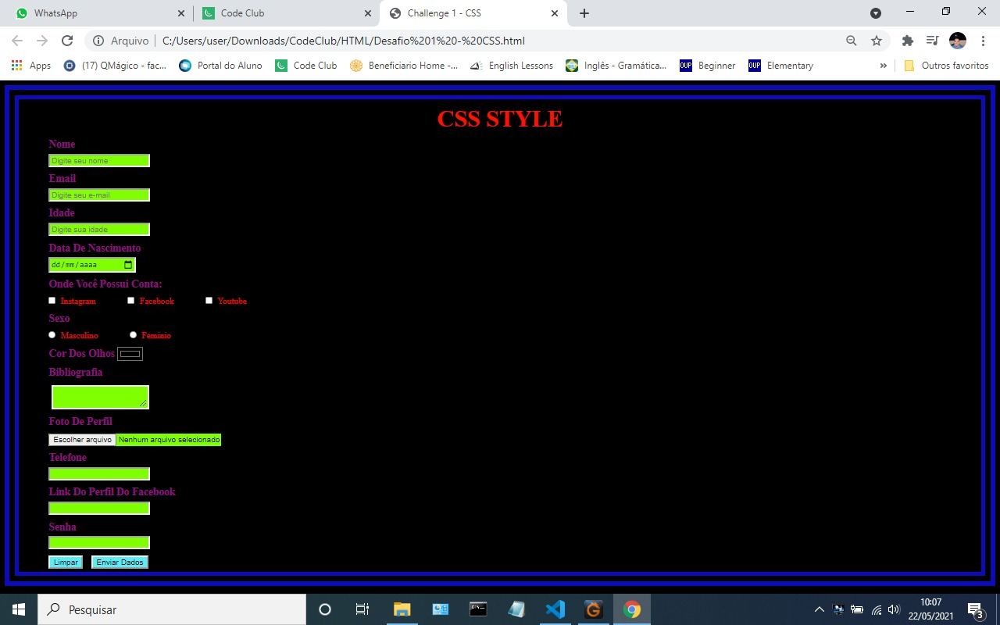

# form-with-CSS
Formulário criado usando HTML e estilizado com CSS.

> Resultado da criação do formulário.

### Ajustes e melhorias

Este formulário foi criado com o intuito de desenvolver e aprimorar alguns conhecimentos em HTML e CSS, ele ainda está em desenvolvimento e as próximas atualizações serão voltadas nas seguintes tarefas:

- [x] Criação do HTML
- [x] Criação do CSS
- [ ] Atualização do layout

## 🤝 Colaboradores

Agradecemos às seguintes pessoas que contribuíram para este projeto:

<table>
  <tr>
    <td align="center">
      <a href="https://www.linkedin.com/in/diego-reis-3b734922/">
         
        
          <b>Diego Reis</b>
        
      </a>
    </td>   
       
     
  </tr>
</table>

[⬆ Voltar ao topo](#form) 
